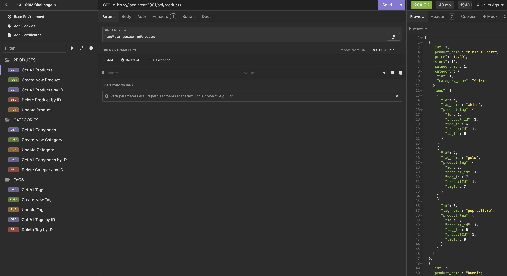

# E-Commerce Back End

## Description

As a manager of an internet retail company I would like to be able to see all of the available merchandise including it's respective information. With this applicaiton users can view their retail using Express, Sequelize, and SQL. 

## Installation

This program uses `dotenv`, `express`, `pg`, and `sequelize`. Users should intstall these dependencies to run the program effectively.

## Usage

The user can choose between Products, Tags, or Categories and interact with the data by either viewing all of the items in that criteria, adding, deleting and/or updating items by utilzing API routes.

## Links
[GitHub-repo](https://github.com/lllewell/e-commerce-back-end-orm)

[walkthrough-video](https://drive.google.com/file/d/1sabfGVV3XBBJBDpNy_YeSd81JxtWCjcv/view?usp=sharing)